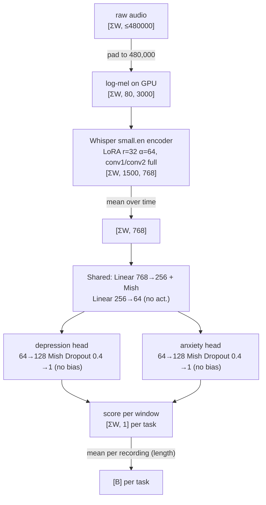

# Model, loss, thresholds, metrics

Numbers are from DAM 1 (`research/stable/ordinal_regression_mtl_mar_2024/`, `config.yaml`).
DAM 2/3 reuse the same head, loss and metrics ([Experiments](experiments.md)).

## Architecture (DAM 1)

| Part | Setting | Where |
|---|---|---|
| Log-mel | 80 bins, n_fft 400, hop 160, per-window z-norm, log10 clip max−8, (x+4)/4, then per-bin shift to `IDEAL_LOGMEL_ENERGIES` | `WhisperTorchFeatureExtractor` |
| Encoder | `openai/whisper-small.en`, decoder dropped, 1500 positions, dropouts 0 | `WhisperBackbone` |
| LoRA | r 32, α 64, dropout 0.4, `all-linear`, bias `all`; `conv1`, `conv2` trained fully | `KintsugiBackboneBase.apply_lora` |
| Shared layers | `[256, 64]`; last layer is the shared factor B in Wt = Ht·B | `MultitaskHead.SharedLayers` |
| Task head | proj 128, dropout 0.4, final Linear without bias (CORAL holds the biases) | `MultitaskHead.TaskHead` |
| Optimizer | AdamW: backbone lr 1.6e-4, head + CORAL biases lr 8e-4, wd 1e-3; MultiStepLR γ 0.5 at epochs 20, 26 | `DepAnxClassifier.configure_optimizers` |
| Precision | fp16 on GPU, DDP `find_unused_parameters=True` | `launcher` |

{{ codemap:model }}

## CORAL loss

One score *s* per window and task; K = 27 (PHQ-9, `num_classes` 28) or 21 (GAD-7, 22) learned
biases bk. Logits s + bk; target is the thermometer code [y > k]
(`torch.gt(y, arange(K))`); BCE summed over cutoffs, each weighted 0/1 by
`ordinal_loss_target_type` (`exact28` / `exact22` = all ones).

| Term | Weight (config key, default) | DAM 1 current |
|---|---|---|
| CORAL | `coral_loss_weight`, 1.0 | 1.0 |
| Variance of window scores within a recording | `score_variance_loss_weight`, 0.0 | 40.0 |
| MSE to teacher score (KD) | `kd_loss_weight`, 0.0; needs `score_targets_csv` | 0 |

Train: per-window loss, averaged within each recording, then over recordings. Val/test: loss of the per-recording mean score
(`mean_before_loss`). Total loss = sum over tasks.

{{ codemap:loss }}

## Thresholds

Tuned after every validation on the per-recording scores, stored as buffers in the checkpoint,
reused unchanged on test.

| Method | Optimizes | Algorithm |
|---|---|---|
| `accuracy`, `absolute_error`, `macro_recall` | per-sample cost | DP, O(n) |
| `macro_precision`, `macro_f1` | per-class cost | DP over cost matrix, O(t²) |
| `coral` | none | −bk at the metric cutoffs (learned in training) |

Candidates: midpoints between unique validation scores, plus ±∞. Classes come from
`METRIC_TARGET_CUTOFFS`: depression (9, 14) → 3 classes, anxiety (4, 9, 14) → 4 classes; a label
counts the cutoffs it exceeds (strict >). Report cards default to `macro_f1`.

## Metrics

For each binary cut (e.g. PHQ > 9, PHQ > 14), `IndetSnSpArray` evaluates every (lower, upper)
threshold pair; scores in between are **indeterminate**. At budgets of 0 % and 40 %
indeterminate, it reports AUROC and the best min(Sn, Sp) (`sn_eq_sp`). Cuts are averaged per
task, tasks are combined by harmonic mean.

| Metric | Use |
|---|---|
| `metrics/val/sn_eq_sp@0%i` | selects the checkpoint and drives early stopping (patience 10 validations) |
| `metrics/val/auroc@0%i`, `@40%i` | reported |
| `metrics/test/sn_at_val_eq_thresh@…`, `sp_…`, `indet_frac_…` | test at thresholds chosen on val |

A validation runs every `training_examples_per_eval` recordings (16,000 in DAM 1), else once per epoch.

{{ codemap:metrics }}
